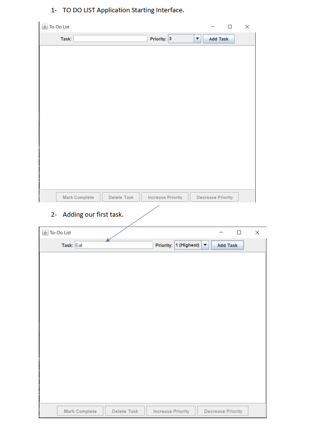
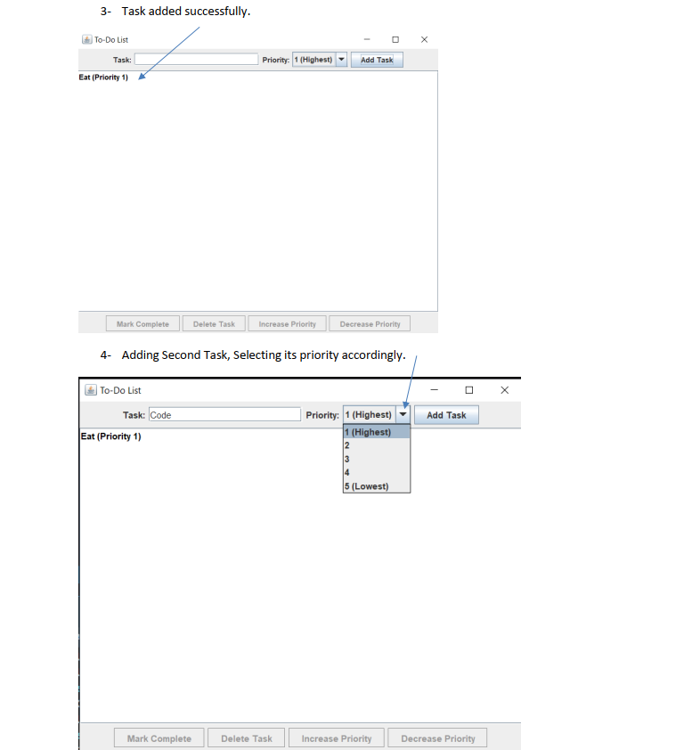
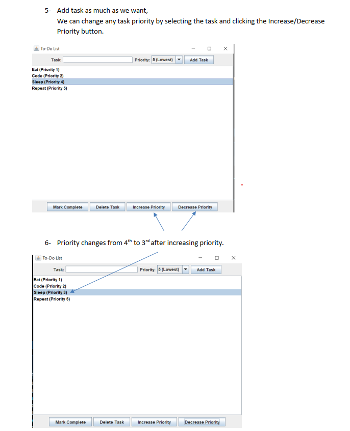
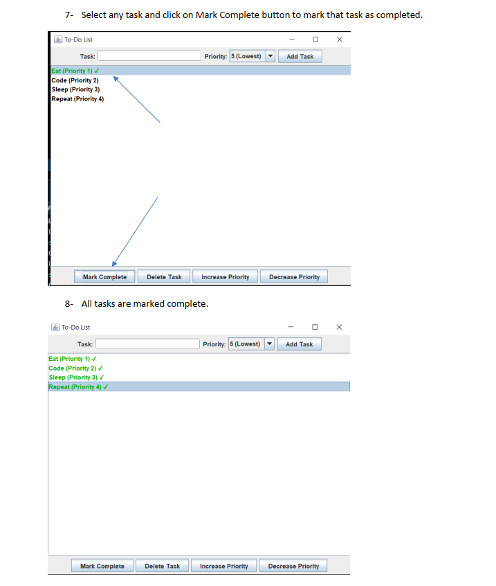
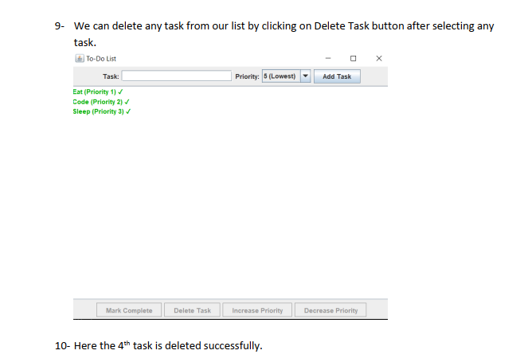

# 📝 Java GUI To-Do List Application

A simple **Java Swing-based To-Do List** application that helps you manage tasks with priorities. You can add, delete, mark complete, and reorder tasks based on priority.

---

## 🚀 Features

- Add new tasks with priorities from 1 (Highest) to 5 (Lowest)
- Increase or decrease task priority
- Mark tasks as completed (✓)
- Delete tasks from the list
- Clean and minimal GUI

---

## 🧰 Technologies Used

- Java
- Java Swing for GUI
- Event-driven architecture

---

## 📷 Application Screenshots

### 🖥️ 1. Application Launch & Adding First Task
- Shows the initial interface
- User enters the first task with a selected priority  


---

### ✅ 2. Task Added & Adding Second Task
- First task added successfully  
- Second task being entered with priority selection  


---

### 📋 3. Adding More Tasks & Changing Priority
- Multiple tasks added  
- Selected task's priority is increased from 4th to 3rd  


---

### 🟩 4. Marking Tasks as Complete
- Tasks are marked complete using the **Mark Complete** button  
- All tasks are shown in green with ✓  


---

### ❌ 5. Deleting Tasks
- User deletes a task using the **Delete Task** button  
- The 4th task is successfully removed  


---

## 🧪 How to Run

1. Clone this repository:
   ```bash
   git clone https://github.com/your-username/your-repo-name.git
   cd your-repo-name
